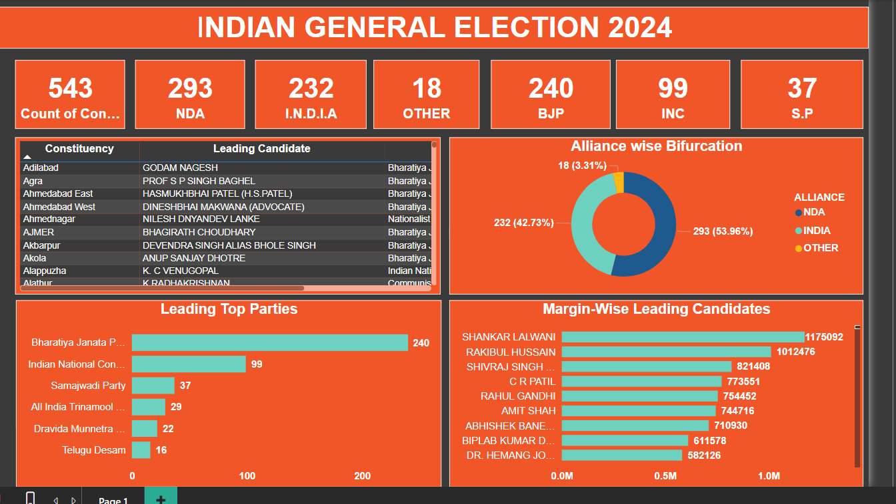

# 🗳️ General Election 2024 Dashboard

This Tableau dashboard visualizes the results of the **Indian General Election 2024** with insights into party-wise seats, leading candidates, and vote margins.

## 📊 Dashboard Overview

- **Total Constituencies:** 543
- **Major Alliances:**
  - 🟦 NDA: 293 seats
  - 🟥 I.N.D.I.A: 232 seats
  - 🟨 Others: 18 seats
- **Leading Parties:**
  - 🏛️ **BJP:** 240 seats
  - 🏛️ **INC:** 99 seats
  - 🏛️ **Samajwadi Party:** 37 seats

## 📷 Dashboard Preview

## 📌 Features

✅ **Party-wise Seat Distribution**  
✅ **Alliance-wise Bifurcation**  
✅ **Leading Candidates & Vote Margins**  
✅ **Interactive Tableau Visualization**  

## 🚀 How to Use

1. Open the Tableau file (`.twbx`) to explore interactive visualizations.
2. Filter data based on constituencies, parties, or alliances.
3. Analyze vote margins and party performance.

## 📈 Built With

- **Tool:** Tableau
- **Data Source:** Election Commission of India (ECI)
- **Visualization Elements:** Bar Charts, Pie Charts, and Tables

## 📢 Contributors

- **Vaibhav Chauhan**
- 

---

📌 *For more details, visit the Tableau Public dashboard link (https://www.tableau.com/community/public).*  
